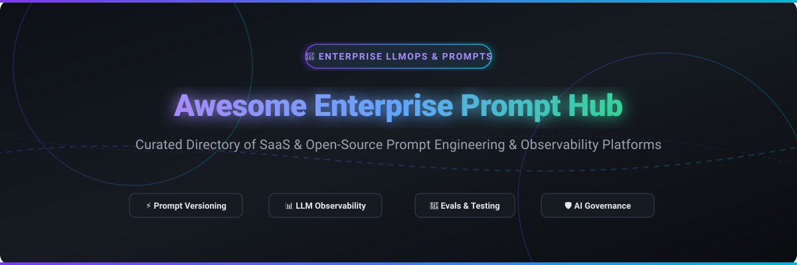

# 🚀 Awesome Enterprise Prompt Hub

  

  

---

## 🎯 Overview & Key Features

Welcome to the **Awesome Enterprise Prompt Hub** directory! This repository tracks premier **SaaS platforms** and **Open-Source GitHub projects** designed for **Enterprise Prompt Hubs**, **LLMOps**, **Prompt Versioning**, **LLM Observability**, and **AI Application Evaluation**. 

Whether you are an AI Engineer, LLMOps lead, or Enterprise Architect, this curated hub helps you discover, evaluate, and choose tools to manage prompt lifecycles, monitor LLM performance, enforce AI governance, and execute continuous evaluations.

---

## 📌 Table of Contents

- [📊 Enterprise SaaS Platforms](#-enterprise-saas-platforms)
- [🔓 Open-Source GitHub Projects](#-open-source-github-projects)
- [💡 How to Contribute](#-how-to-contribute)
- [⚖️ Disclaimer](#%EF%B8%8F-disclaimer)
- [💖 Support & Sponsoring](#-support--sponsoring)
- [📈 Star History](#-star-history)

---

## 📊 Enterprise SaaS Platforms

> 💡 **Market Overview:** The Enterprise Prompt Management & LLMOps sector is estimated at **$1.8B in 2026** (projected to reach **$12.5B by 2030** at a ~45% CAGR) and is currently **moderately fragmented**, undergoing rapid strategic consolidation with database leaders and AI giants acquiring category innovators (e.g., ClickHouse acquiring Langfuse, Palo Alto Networks acquiring Portkey, Anthropic acquiring Humanloop).

The table below summarizes leading enterprise-grade SaaS platforms for prompt management, prompt playgrounds, LLM observability, and evaluation. Sorted by **Company Size / Valuation (Descending)**:

| Platform 🏢 | Description 📝 | Starting Price 💵 | Free Tier Limits 🎁 | Company Size / Valuation 📈 |
| :--- | :--- | :--- | :--- | :--- |
| **[LangSmith](https://www.langchain.com/langsmith)** | LangChain’s enterprise platform for tracing, prompt versioning, eval, and debugging. | **$39 / seat / mo** (Plus Plan) | **5,000 base traces / mo**, 1 seat, 14-day data retention | **$1.25B Valuation** ($260M Raised) |
| **[Braintrust](https://www.braintrust.dev/)** | Evaluation-centric LLM testing, prompt engineering, dataset management & VPC evals. | **$249 / mo** (Pro Plan) | **1 GB processed data / mo**, 10,000 scores / mo, 5 seats, 14-day retention | **$800M Valuation** ($120M Raised) |
| **[Portkey](https://portkey.ai/)** | AI gateway & LLMOps platform for prompt management, routing, observability & guardrails. | **$49 / mo** (Team Plan) | **10,000 recorded logs / mo**, unlimited users | **$140M Valuation** (Acquired by Palo Alto Networks) |
| **[Humanloop](https://humanloop.com/)** | Prompt engineering & eval workspace (acquired by Anthropic, integrated into team workflows). | **$49 / mo** (Legacy Pro) | **10,000 logs / mo**, 50 evals / mo, 2 seats (Legacy) | **Acquired by Anthropic** ($7.9M Raised) |
| **[Langfuse](https://langfuse.com/)** | Managed cloud & open-source platform for prompt CMS, LLM tracing, evals & playgrounds. | **$29 / mo** (Core Plan) | **50,000 billable units / mo**, 2 seats, 30-day retention | **Acquired by ClickHouse** ($4.5M Seed Raised) |
| **[Helicone](https://www.helicone.ai/)** | AI gateway & observability platform for prompt management, latency/cost tracking & experimentation. | **$79 / mo** (Pro Plan) | **10,000 requests / mo**, 1 seat, 1 GB storage, 7-day retention | **Acquired by Mintlify** ($500K Seed Raised) |
| **[PromptLayer](https://www.promptlayer.com/)** | Dedicated prompt management CMS with semantic versioning, A/B release labels & team evals. | **$49 / mo** (Pro Plan) | **2,500 requests / mo**, 5 seats, 250 eval executions / mo, 1 workspace | **$4.8M Funding** (Seed Stage) |
| **[Agenta](https://agenta.ai/)** | Open-source LLMOps platform with web playground, git-like prompt variants & evals. | **$20 / user / mo** (Cloud Pro) | **5,000 agent runs / mo**, 2 seats, 7-day data retention | **Seed Stage** (Antler Backed) |
| **[Keywords AI](https://www.keywordsai.co/)** | LLM monitoring, prompt management registry, and analytics for production AI applications. | **$49 / mo** (Team Plan) | **10,000 logs / mo**, unlimited prompts | **Bootstrapped** (~$1.1M ARR) |
| **[Promptitude](https://www.promptitude.io/)** | Prompt management and optimization tooling for embedding prompts & flows into production. | **$39 / mo** (Starter Plan) | **100 generations & 200 tool calls / mo**, 5 prompts, 2 seats | **Bootstrapped / Early Stage** |

---

## 🔓 Open-Source GitHub Projects

For privacy-first, self-hostable, and developer-centric LLMOps architectures, open-source projects offer full data control, zero-vendor-lockin, and flexible self-hosting. 

Below are top open-source prompt hubs, LLM gateways, and evaluation frameworks, sorted by **GitHub Star Count (Descending)**:

| Project 📦 | Repository Link 🔗 | Description 📜 | Star Count Badge ⭐ |
| :--- | :--- | :--- | :--- |
| **LiteLLM** | [BerriAI/litellm](https://github.com/BerriAI/litellm) | Call 100+ LLM APIs using OpenAI format, feature-rich AI gateway, load balancer & prompt proxy. |  |
| **Langfuse** | [langfuse/langfuse](https://github.com/langfuse/langfuse) | Open-source AI engineering platform—prompt management, observability, tracing & automated evals. |  |
| **Promptfoo** | [promptfoo/promptfoo](https://github.com/promptfoo/promptfoo) | CLI framework for evaluating, security-testing & red-teaming LLM prompts, agents & RAGs. |  |
| **Opik** | [comet-ml/opik](https://github.com/comet-ml/opik) | Open-source platform for evaluating, testing, and monitoring LLM applications & prompts. |  |
| **Portkey Gateway** | [Portkey-AI/gateway](https://github.com/Portkey-AI/gateway) | Extremely fast AI gateway for routing, fallbacks, prompt security & retries across 200+ LLMs. |  |
| **Arize Phoenix** | [arize-ai/phoenix](https://github.com/arize-ai/phoenix) | AI observability & evaluation library for prompt debugging, tracing, and LLM-as-a-judge benchmarks. |  |
| **Promptflow** | [microsoft/promptflow](https://github.com/microsoft/promptflow) | Microsoft's suite of development tools for prompt engineering, flow building, evals & deployment. |  |
| **OpenLLMetry** | [traceloop/openllmetry](https://github.com/traceloop/openllmetry) | OpenTelemetry-based tracing and observability for LLMs, prompts, and vector databases. |  |
| **Helicone** | [Helicone/helicone](https://github.com/Helicone/helicone) | Open-source AI gateway & observability stack—one-line logging, prompt caching & cost analytics. |  |
| **Agenta** | [Agenta-AI/agenta](https://github.com/Agenta-AI/agenta) | Developer-centric open-source LLMOps platform for prompt management, playground experimentation & evals. |  |
| **TruLens** | [truera/trulens](https://github.com/truera/trulens) | Open-source evaluation tool for LLM apps, measuring RAG triad (groundedness, relevance, feedback). |  |
| **Laminar (Lmnr)** | [lmnr-ai/lmnr](https://github.com/lmnr-ai/lmnr) | Open-source AI engineering platform for prompt versioning, tracing, and execution pipelines. |  |
| **OpenPipe** | [openpipe/openpipe](https://github.com/openpipe/openpipe) | Open platform for collecting prompt logs, fine-tuning smaller open models, and evaluating outputs. |  |

---

## 🛠️ Typical Enterprise LLMOps Workflow

1. **Prompt Engineering:** Author prompts collaboratively in a web playground or code workspace.
2. **Versioning:** Tag prompt releases (e.g., `v1.2.0-prod`) in a centralized Prompt Registry.
3. **Continuous Evaluation:** Run LLM-as-a-judge tests and regression evaluations against golden datasets.
4. **Deployment & Gateway:** Route prompts through an AI Gateway for caching, rate limiting, and fallback handling.
5. **Observability:** Monitor token costs, latency, user feedback, and trace spans in production.

---

## 💡 How to Contribute

Contributions are warmly welcomed! Help keep this enterprise prompt hub up to date:

1. 🍴 **Fork** this repository.
2. 📝 **Add/Edit** entries in `README.md` following the existing markdown table format.
3. 🔍 Ensure pricing, free tier limits, company valuation/funding, and open-source star badges are accurate.
4. 🚀 Submit a **Pull Request** with a clear explanation of your changes.

Check out [Awesome Lists](https://github.com/ishandutta2007/Awesome-Awesome-Awesome) for more curated tech collections!

---

## 💖 Support & Sponsoring

If you find this repository helpful for your AI Engineering or LLMOps team:
- ⭐ **Star** this repository to show your support!
- 🔀 **Fork** and share it with your network or team.
- ☕ **Buy me a coffee / Sponsor:** If you'd like to sponsor the maintenance of this list, visit the [GitHub Sponsor Dashboard](https://github.com/sponsors/ishandutta2007). Thank you for supporting open-source AI tools!

---

## ⚖️ Disclaimer

- This directory is a **community-curated list** for informational and educational purposes.
- Product features, pricing models, free tier limits, and corporate funding status change frequently. Always consult official vendor sites for real-time pricing and SLA guarantees.

---

## 📈 Star History

